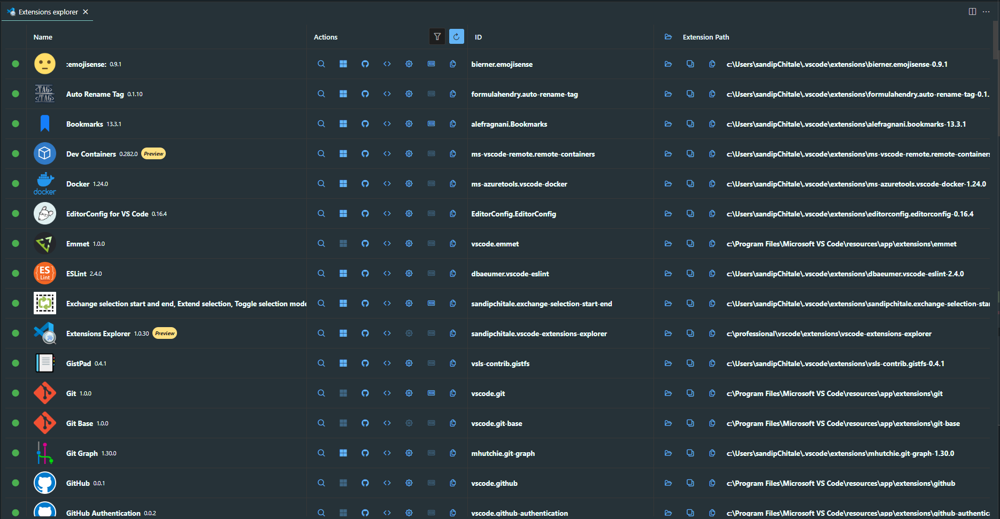

# Extensions Explorer

Explore installed VSCode extensions in editor:

- list extensions
  - show extension active status
  - show extension icon
- show @installed extensions in extensions view
- search for extension (by id) in extensions view
- open extension enrty on VSCode Marketplace
- open extension repository in desktop browser
- load extension package.json in editor
- go to extension settings
- show keybindings
- copy extension ID to clipboard
- show extensions folder in file explorer
- open extension folder in new VSCode window
- show extension folder in file explorer
- copy extension folder path to clipboard

# Known Issues

None
